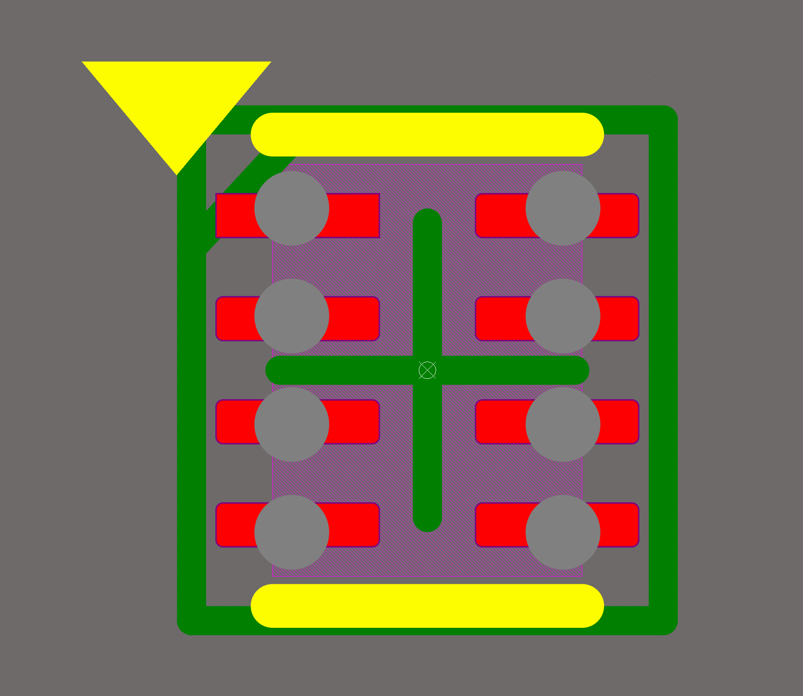
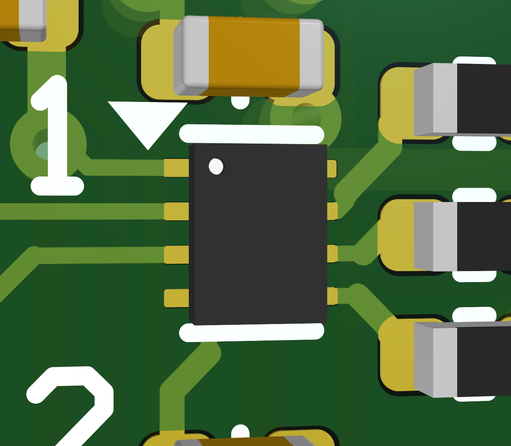
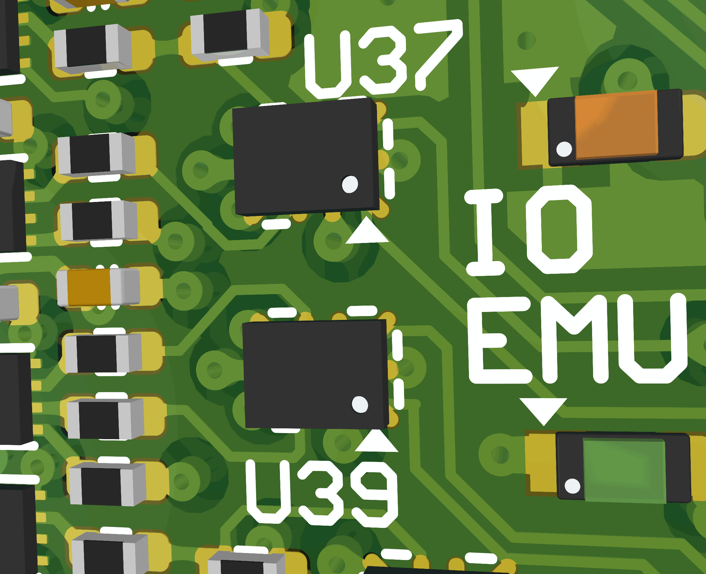

Fine Pitch Components
=====================

The goal is to reflow 0.35 mm pitched components (and everything larger) more reliably. 
This collection of techniques is a result of ~ 10 years of designing and manually finishing PCBs. 
But they are only suggestions as most of them come with a tradeoff.

First off: by letting a manufacturer handle your PCBs the result will already be improved and you can get away with suboptimal design. 
They have professional tools at their disposal and the process is dialed in:

- a proper stencil frame can lift the stencil parallel to pcb
- with high throughput comes fresher paste and smaller, more expensive solder balls (if needed)
- a solder paste printer often optimizes the paste-pads depending on the copper-pad-shape
- pick and place machine are more precise and faster (paste does dry less)

Subsections
''''''''''''''''''

- Pads
- Traces
- Solder Mask
- Paste Mask
- Summary
- Examples with Pictures

Pads
-----

#. extend pads from under IC
	- Specially for QFN / DFN Packages it helps to trade some extra space for better access with probes oder soldering iron (fix shorts). 
	- 0.2 - .5 mm extra are a good estimate, depending on your equipment
	- BGA and similar packages can be easier placed with some visible copper as a reference (silk-layer and solder mask can be offset and are not recommended for referencing!)
	- solder paste can flow and collect outside instead of connecting to neighbouring pad under the IC
	- mechanical advantage as more copper is bonded to the substrate
#. slim the pad
	- more distance to neighbouring pad is often better than the mechanical advantage (see solder mask chapter for more detail)
	- rule of thumb: pad can easily be as narrow as the minimal width of the IC-Pin
#. thermal pads
	- thermals are often recommended too large in datasheet and therefor too near main pads, adjust for > .30 mm gap
	- if metal under IC is really that large think about placing a keep-out-area on the free space to avoid putting vias there
	- or cover vias with solder mask (tainted via) and silk-screen for extra protection

Traces
------

#. Neckdown
	- leave a pad with a trace that is <= pad-width, otherwise the pad is widend depending on your solder mask expansion and can cause solder paste shorts
#. Fanout
	- going straight out of the pad also helps to avoid solder paste shorts (if there is a pad next to it)
	
Solder Mask
-----------

#. default solder mask expansion
	- solder mask is more efficient in avoiding shorts than the bare substrate
	- expansion: means the mask opening around a pad is larger than the copper itself (for positive values)
	- manufacturers like betalayout or eurocircuits demand an expansion of ~ .1 mm to compensate for layer-offsets during manufacturing
	- offsets became very rare though, so defaulting to .04 - .06 mm is often fine (PCB Constraint)
	- in special cases like .35mm-pitched components it helps to go as low as .01 mm to meet the minimal gap between narrow pad (see mask sliver next)
#. minimum solder mask sliver (width of mask bridge between pads)
	- larger gaps help to avoid shorting the solder paste during reflow
	- enforcing a minimum gap of (at least) .2 mm between pads (PCB Constraint) even for .35mm-pitched components helps to avoid solder paste shorts during reflow
	- it's beneficial for fine pitched components to reduce the mask expansion to widen the gap 
	- it would also be possible to set the expansion to negative values (narrower solder mask with reference to copper)

Paste Mask
----------

#. adapt mask to stencil
	- fine pitch components demand for thinner stencils
	- as pads are getting smaller the ratio between pad-surface (=adhesion to copper) and wall-surface of the stencil is getting worse
	- paste is prone to stick to smaller holes
	- stencil wall surface can be reduced by using round holes, they are also easier to clean
#. adapt mask to solder paste
	- solder paste consists of small balls, classified by grain-size (T3 = 25 to 45 um, T4 = 20 to 38 um, T5 = 15 to 25 um)
	- depending on the paste the experience over the years show that the smallest reliable width is ~ 5 to 6 of the largest balls (for T3 around 250 um)
	- that limit calls for manual designed paste pads for fine pitched components 
#. adapt mask to pads
	- observation: defaulting to 100% pad-fill is often a bad idea, as it is way too much paste
	- depending on stencil thickness the default padfill can be reduced by 30 % (100 um Stencil) to 50 % (150 um Stencil)
	- large fills on thermal pads can let your IC swim and don't connect to the pins -> reducing fill to 50 % (100um stencil) and splitting the paste to smaller fragments is a good idea
	- paste is not limited to copper area for ensuring the min width (250 um Paste and 150 um Pad work, see examples later)
#. adapt mask to IC
	- suggestions for packages without leads (QFN, DFN, ...) and especially for packages where the metal of the pin extends to side of the IC
	- reflow results improve when part of the paste pad extends from under the IC (~30%)
	- solder is less prone to cause shorts under the IC as it collects in a reservoir right in front of the IC when it is not needed under the IC
	
Summary
-------

- default to slimmer but longer pads that optionally extend from under the IC
- PCB-Constraint: pad neckdown of <= 100%
- PCB-Constraint: solder mask extension can be .02 - .06 mm by default
- PCB-Constraint: solder mask sliver (Gap) should be >= .2 mm
- PCB-Constraint: paste mask reduction of ~ 30 % for 100 um Stencil but keep minimum width >= 5-6 x your largest paste balls (250 um for T3 Paste)
- manual solder mask extension for fine-pitched components (to meet the min gap between pads)
- manual paste pads for fine-pitched components (to meet minimum paste width)
- custom footprints are generally a good idea

Examples
--------

- Footprints generated with the IPC compliant footprint wizard in Altium, based on parameters from datasheet
- usage of the suggestions from above for footprints
- optimized for T3 Paste, 100 um Steel-Stencil
- tested successfully with manufacturers: betalayout, eurocircuits
- color-legend for the pictures
	- red: copper pad
	- purple: solder mask expansion
	- violet: outline of 3D-Model
	- yellow: silk screen
	- grey: paste mask
	- green: assembly-layer with marking for reference and pin1

SOT95 (TSOT23-6)
''''''''''''''''''

- pitch is .95 mm
- pads are .55 x .90 mm and therefor ok for automatic paste reduction of 30%
- solder mask sliver of >= .2 mm is satisfied with default mask expansion of 0.1 mm

	
SOP50 (TSSOP50-N10)
''''''''''''''''''

- pitch is .50 mm
- pads are .25 x .70 mm with reduced mask expansion = .025 mm to satisfy the .2 mm gap between pads
- paste pads are .30 x .45 -> larger than pad with a fill ratio of ~ 75 %

	

PSON50
'''''''''

- pitch is .50 mm
- pads are .23 x .85 mm, reduced mask expansion = .03 mm
- paste pads are .26 x .50 mm for 66 % fill ratio
- thermal pad fill is 45 %
- previous recipes for desaster (shorted paste)
	- pads .25 x .65 mm, mask expansion = .06 mm, paste .30 x .50 (Gap .133 mm, fillratio = 92%) -> fixable by soldering

	

SON35 (XSON8, SOT1203)
'''''''''''''''''''''''''''

- pitch is .35 mm
- pads are .13 x .55 mm with reduced mask expansion = .005 mm to satisfy the .2 mm gap between pads
- paste pads are round with .25 um diameter, pad-fill = 69 %, slightly offset to allow more distance
- previous recipes for desaster (shorted solder paste under IC)
	- pads .18 x .45 mm, .03 mm expansion, paste .25 x .40 mm (Gap = .115 mm, fillratio = 123%) -> not fixable shorts under the IC
	- pads .16 x .52 mm, .03 mm expansion, paste .22 x .30 mm (Gap = .135 mm, fillratio = 80%) -> not fixable shorts under the IC

	

	
BGA12
''''''

- pitch is .50 mm
- pads are .22 x .45 (outer row) with reduced mask expansion = .03 mm to widen the gap between pads
- paste pads are round with .25 um diameter, pad-fill = 50 % as the microbumps melt on their own and paste is just to fix the component to the pcb
- longer outer pads allow for better manual pick and place
- previous recipes for desaster (shorted solder paste under IC)
	- pads round .25 mm, reduced solder mask expansion .03 mm, paste mask round x31 mm (gap = .132 mm, fillratio = 123%) -> not fixable shorts under the IC

	
LGA-Module
'''''''''''

- pitch is 1.1 mm
- pads are round with d = .60 mm
- pad-fill is 100 %, ok due to large gap between pads
- copper-trace-cross helps positioning component manually

	